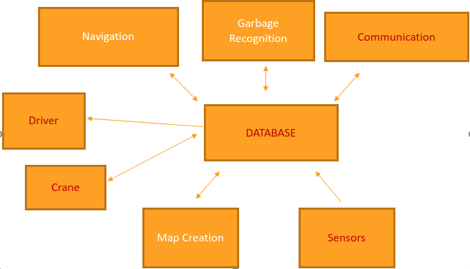
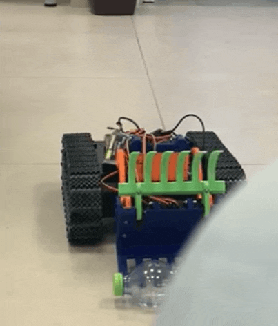

# AutoClean

<h1 align="center">
  
</h1>
  

    <a href="mailto:oreltsioni@gmail.com">Orel Tsioni</a> •
    <a href="mailto:itamar.meyer@campus.technion.ac.il">Itamar Meyer</a>
  

in this project we implemented the basic infrastructure for the world cleaner robot. 
This robot can drive with given speed and rotate in different angles. Also, he can lift trash using 3 axis arm that moves with Servo motors. The driving operations are implemented using basic control that is needed for more accurate angle rotation.
This project includes few modules that act independently that we will elaborate about.

- [AutoClean](#autoclean)
  * [Architecture](#architecture)	
  * [SQL database](#sql-database)
  * [Sensors](#sensors)
  * [Driver](#driver)
  * [Communication](#communication)
  * [Crane](#crane)
  * [Further Work](#further-work)

## Architecture

 

The independence of each modules is based on the fact  each of this module know only the center database.
The communication between modules is done through this Database. for instance driver uses sensors table info for driving control and sensors module update this SQL table.
The non-red modules are part of [Further Work](#further-work) 

## SQL database
The center of all data transmission. all modules commuinicate with the sql server by writing and reading from it when needed.
this way we create modularity in our software and we create an easy environment for future development.
the sql server is Azure SQL Edge which runs on the ubuntu of the TX2 nvidia device via docker. We are using it for sensors and driver module use cases such as driver need to operate based on sensors information or driver need to execute a driving command. The SQL database holds those commands and sensors info in different tables and all the modules communicate through them.

## Sensors
This module is all about getting the info from the pixhawk(sensors device) and deliver it to the sql server

## Driver

 

The driver modules gets a string of driving instructions which he can parse. those instructions are coming from the instructions list in the sql db
this way we can control the driving while creating the base for future module to send the instructions itself.
Driver uses 4 motors that gets command from sabertooth controller 2x12 which gets commands from the nvidia TX2.

## Communication
This module role is to be the mediator between groundstation and the world cleaner. also if needed to communicate between devices on robot itself.

## Crane

 

The world Cleaner uses a 3D printed claw with 3 axis. Each of the 3 axis is moving using 2 servo motors which conrolled by lynxmotion controller. Lynxmotion gets commands from the crane sql table that is on nvidia TX2

## Further Work
Implement Computer Vision based module for navigation control. Also, implement and add a CNN for Trash classification and recognition for Crane operation.
